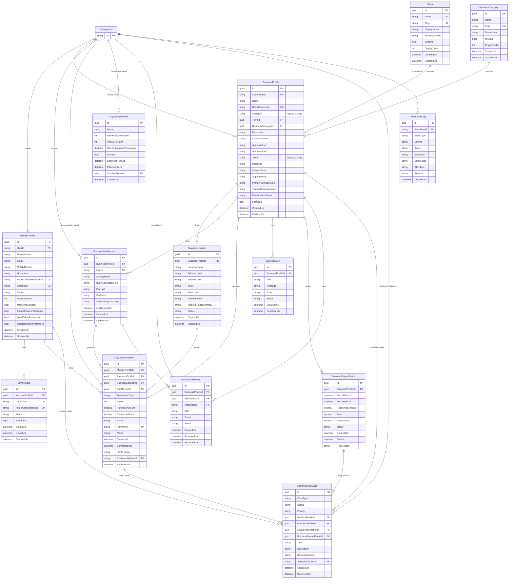

# Love-Brackley Loyalty ER Diagram

```mermaid
erDiagram
	ExistingUser ||--o| MemberProfile : "UserId"
	ExistingUser ||--o{ BusinessProfile : "OwnerUserId"
	ExistingUser ||--o{ BusinessStaffAccess : "UserId"
	ExistingUser ||--o{ LoyaltyTransaction : "ReviewedByUserId"
	ExistingUser ||--o{ LoyaltyPointsRule : "CreatedByUserId"
	ExistingUser ||--o{ SecurityAuditEntry : "ActorUserId"
	ExistingUser ||--o{ AdminReviewCase : "AssignedToUserId"
	ExistingUser ||--o{ AdminAuditLog : "ActorUserId"

	MemberProfile ||--o{ LoyaltyCard : has
	MemberProfile ||--o{ LoyaltyTransaction : owns
	MemberProfile ||--o{ AdminReviewCase : "member cases"

	Town ||--o{ BusinessProfile : contains
	BusinessCategory ||--o{ BusinessProfile : classifies
	BusinessProfile ||--o{ BusinessLocation : has
	BusinessProfile ||--o{ BusinessStaffAccess : has
	BusinessProfile ||--o{ LoyaltyTransaction : receives
	BusinessProfile ||--o{ BusinessAlert : has
	BusinessProfile ||--o{ BusinessPayoutPeriod : settles
	BusinessProfile ||--o{ SecurityAuditEntry : logs
	BusinessProfile ||--o{ AdminReviewCase : "business cases"

	BusinessLocation ||--o{ LoyaltyTransaction : records
	BusinessStaffAccess ||--o{ LoyaltyTransaction : performs
	BusinessStaffAccess ||--o{ SecurityAuditEntry : triggers

	LoyaltyTransaction ||--o{ AdminReviewCase : may_create
	BusinessPayoutPeriod ||--o{ AdminReviewCase : may_create

	ExistingUser {
		string Id PK
	}

	MemberProfile {
		guid Id PK
		string UserId FK
		string DisplayName
		string Email
		string MobileNumber
		string HomeArea
		string PublicMemberReference UK
		string CardCode UK
		string Status
		int PointsBalance
		bool MarketingConsent
		bool EmailUpdatesPreference
		bool LocalOffersPreference
		bool CardReminderPreference
		datetime CreatedUtc
		datetime UpdatedUtc
	}

	LoyaltyCard {
		guid Id PK
		guid MemberProfileId FK
		string CardCode UK
		string PublicCardReference UK
		string Status
		bool IsPrimary
		datetime IssuedUtc
		datetime LinkedUtc
		datetime DisabledUtc
	}

	Town {
		guid Id PK
		string Name UK
		string Slug UK
		string DisplayName
		string PrimaryDomain
		bool IsActive
		int DisplayOrder
		datetime CreatedUtc
		datetime UpdatedUtc
	}

	BusinessCategory {
		guid Id PK
		string Name
		string Slug UK
		string Description
		bool IsActive
		int DisplayOrder
		datetime CreatedUtc
		datetime UpdatedUtc
	}

	BusinessProfile {
		guid Id PK
		string OwnerUserId FK
		string Name
		string BrandReference UK
		string Category "legacy display"
		guid TownId FK
		guid BusinessCategoryId FK
		string Description
		string LocationName
		string AddressLine1
		string AddressLine2
		string Town "legacy display"
		string Postcode
		string ContactEmail
		string SupportEmail
		string PrimaryContactName
		string TradingHoursSummary
		string ParticipationStatus
		bool Featured
		datetime CreatedUtc
		datetime UpdatedUtc
	}

	BusinessLocation {
		guid Id PK
		guid BusinessProfileId FK
		string LocationName
		string AddressLine1
		string AddressLine2
		string Town
		string Postcode
		string TillReference
		string TradingHoursSummary
		string Status
		datetime CreatedUtc
		datetime UpdatedUtc
	}

	BusinessStaffAccess {
		guid Id PK
		guid BusinessProfileId FK
		string UserId FK
		string DisplayName
		string BusinessAccessRole
		string PinHash
		string PinStatus
		string LastActivitySummary
		datetime LastActivityUtc
		datetime CreatedUtc
		datetime UpdatedUtc
	}

	LoyaltyTransaction {
		guid Id PK
		guid MemberProfileId FK
		guid BusinessProfileId FK
		guid BusinessLocationId FK
		guid StaffAccessId FK
		string TransactionType
		int Points
		decimal PurchaseAmount
		decimal RedeemedValue
		string Status
		string Reference UK
		string Notes
		datetime CreatedUtc
		datetime CompletedUtc
		string HeldReason
		string ReviewedByUserId FK
		datetime ReviewedUtc
	}

	LoyaltyPointsRule {
		guid Id PK
		string Name
		int EarnPointsPerPound
		int PencePerPoint
		decimal MaxRedemptionPercentage
		bool IsActive
		datetime EffectiveFromUtc
		datetime EffectiveToUtc
		string CreatedByUserId FK
		datetime CreatedUtc
	}

	BusinessAlert {
		guid Id PK
		guid BusinessProfileId FK
		string Title
		string Message
		string Tone
		string Status
		datetime CreatedUtc
		datetime ResolvedUtc
	}

	BusinessPayoutPeriod {
		guid Id PK
		guid BusinessProfileId FK
		datetime PeriodStartUtc
		datetime PeriodEndUtc
		decimal RedeemedAmount
		decimal Fees
		decimal PayoutTotal
		string Status
		datetime CreatedUtc
		datetime PaidUtc
		string HeldReason
	}

	SecurityAuditEntry {
		guid Id PK
		guid BusinessProfileId FK
		guid StaffAccessId FK
		string ActorUserId FK
		string Title
		string Detail
		string Status
		datetime CreatedUtc
		datetime ReviewedUtc
		datetime EscalatedUtc
	}

	AdminReviewCase {
		guid Id PK
		string CaseType
		string Status
		string Priority
		guid MemberProfileId FK
		guid BusinessProfileId FK
		guid LoyaltyTransactionId FK
		guid BusinessPayoutPeriodId FK
		string Title
		string Description
		string ResolutionNotes
		string AssignedToUserId FK
		datetime CreatedUtc
		datetime ResolvedUtc
	}

	AdminAuditLog {
		guid Id PK
		string ActorUserId FK
		string EntityType
		string EntityId
		string Action
		string Summary
		string BeforeJson
		string AfterJson
		string Reason
		datetime CreatedUtc
	}
```
